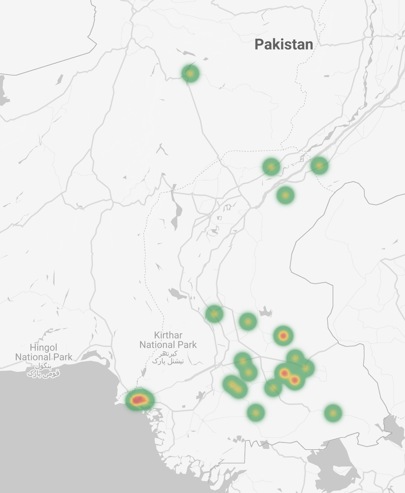
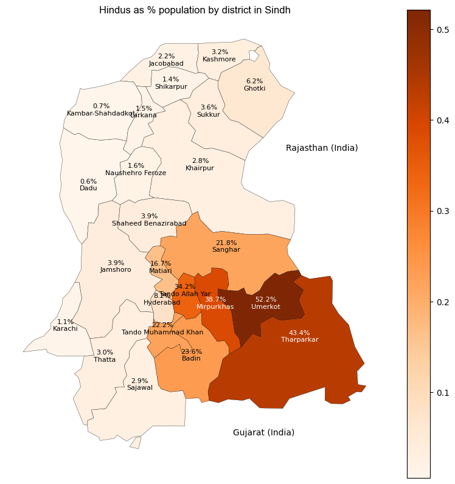

#### || Shree Ganeshaya Namaha || || Har Har Mahadev || || Jai Hinglaj Mata ||

# Hindus in Pakistan

This repo contains data regarding Hindus in Pakistan - list of Hindu temples (WIP), a crowd-sourced dataset on forced religious conversion cases of young Hindu girls (especially in Sindh) etc. This repo is meant to provide base data for further analysis by researchers, scholars and interested parties.  
  
Please provide proper attribution and reference if you use these datasets.  
  
---  
  
## Dataset on violence / abduction / forced religious conversion of young Hindu girls in Pakistan (especially in Sindh)

A detailed dataset has been prepared for cases relating to abduction, violence, forced conversion of/on Hindu girls in 
Pakistan (especially Sindh that is home to ~94% Hindu population of Pakistan). The dataset has been primarily sourced 
from Twitter. While attempts have been made to capture data as accurately as possible, errors are regretted and any 
updates or additions to this dataset are welcome and appreciated.

### These attacks happen the most in areas with relatively high Hindu populations.

    

<i>Left: Heatmap of cases in the master dataset; right: Heatmap of Hindu population as a % of total population 
(source: <a href="https://github.com/vindicindic/pakistan_minorities">here</a>)</i> 

**Master Dataset**: This dataset called DAAHIP-W (Dataset of Atrocities Against Hindus in Pakistan - Women) contains 
a list of cases that capture critical details about recorded atrocities against Hindu women in Pakistan. You can access 
the dataset [here](data/daahip-w/20230131_list_violence_abductions_forced_conversions_hindu_women_in_pakistan.xlsx).

<table>
    <tr>
        <th>Current # cases in dataset</th>
        <td>56</td>
    </tr>
    <tr>
        <th>Time-horizon</th>
        <td>approx. Oct '22 - Jan '23</td>
    </tr>
</table>

**Data dictionary**: Click <a href="data/data_dictionary.xlsx">here</a> to access the data dictionary for this dataset 
(Sheet name = DAAHIP-W)  

**Additional data**: You can also check out photos of victims, perpetrators, FIR documents etc. in the `data` folder. 
Each case in the master dataset is indexed using a case ID. If there is any additional data for a case (e.g. pictures, 
documents etc.), you will find a dedicated folder for that case in the `data/forced_conversions_case_data` folder. For 
example, for case # 9, you will want to look at folder titled `case_9`.

#### Help me add new or missing cases to the dataset
You can use <a href="https://docs.google.com/forms/d/e/1FAIpQLSfKJotL3I1i5zj-RV45OP-dm-J0CIopWCDQGisoZSkmKt4h7A/viewform">this Google Form</a> to inform me about any new/missing case. Thank you in advance!

#### Special thanks to the following people for sharing information on these cases:
1. [Narain Das Bheel](https://twitter.com/NarainDasBheel8)
2. [Anshul Saxena](https://twitter.com/AskAnshul)
3. Sakshi Singh

----  
## Get involved

1. If you wish to save Pakistani Hindu girls from being abducted and forcibly converted, consider getting involved with Project Chingari. You can check the details [here](https://hindupact.org/category/chingari-project/).

2. To suggest any changes or additions to this dataset, please write to vindicindic@gmail.com

3. I am currently looking for volunteers who can read Urdu and help me extract data from images of documents. Please write to me at vindicindic@gmail.com if you'd like to help. 
