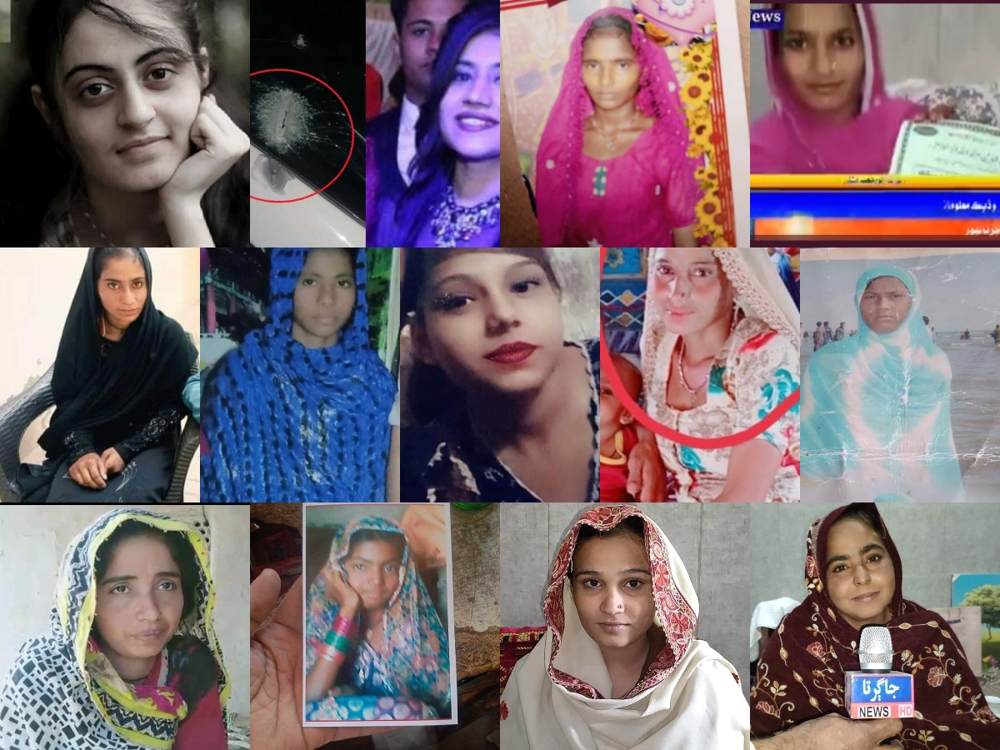

#### || Shree Ganeshaya Namaha || || Har Har Mahadev || || Jai Hinglaj Mata ||

# Hindus in Pakistan

This repo contains data regarding Hindus in Pakistan - list of Hindu temples (WIP), a crowd-sourced dataset on forced religious conversion cases of young Hindu girls (especially in Sindh) etc. This repo is meant to provide base data for further analysis by researchers, scholars and interested parties.  
  
Please provide proper attribution and reference if you use these datasets.  
  
---  
  
## Dataset on forced religious conversion of young Hindu girls in Pakistan (especially in Sindh)

A detailed dataset has been prepared for cases relating to forced conversion of Hindu girls in Pakistan (especially Sindh that is home to ~94% Hindu population of Pakistan). The dataset has been primarily sourced from Twitter. WHile attempts have been made to capture data as accurately as possible, errors are regretted and any updates or additions to this dataset are welcome and appreciated.

**Master Dataset**: You can access the dataset [here](data/20230131_list_forced_conversions_in_pakistan.xlsx).

**Additional data**: You can also check out photos of victims, perpetrators, FIR documents etc. the `data` folder. Each case in the master dataset is index using a case ID. If there is any additional data for a case (e.g. pictures, documents etc.), you will find a dedicated folder for that case in the `data/forced_conversions_case_data` folder. For example, for case # 9, you will want to look at folder titled `case_9`.

#### Special thanks to the following people for sharing information on these cases:
1. [Narain Das Bheel](https://twitter.com/NarainDasBheel8)
2. [Anshul Saxena](https://twitter.com/AskAnshul)
3. Sakshi Singh

----  
## Get involved

1. If you wish to save Pakistani Hindu girls from being abducted and forcibly converted, consider getting involved with Project Chingari. You can check the details [here](https://hindupact.org/category/chingari-project/).

2. To suggest any changes or additions to this dataset, please write to vindicindic@gmail.com

3. I am currently looking for volunteers who can read Urdu and help me extract data from images of documents. Please write to me at vindicindic@gmail.com if you'd like to help. 
